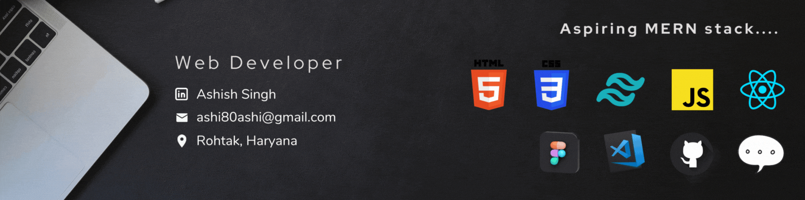

<h1 align="center">Hi, I'm ASHISH</h1>
<h3 align="center">Passionate Web developer & Aspiring MERN stack</h3>

  

- 🌱 I’m currently learning **REACT JS**

- 💬 Ask me about **Web development and designing**

- 📝 I regularly write articles on [Hashnode](https://ashii.hashnode.dev/)

- 📫 Reach me  at **ashi80ashi@gmail.com**

- 👋 connect on LinkdIN [ASHISH](https://www.linkedin.com/in/ashish-singh-93a163215)

<h3 align="left">Connect with me:</h3>

<h3 align="left">Languages and Tools:</h3>

 

 

 
 

&nbsp;

